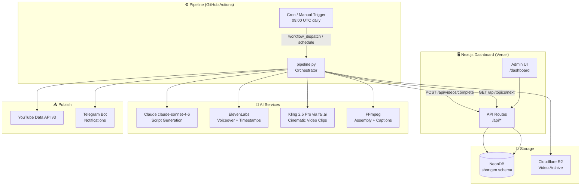
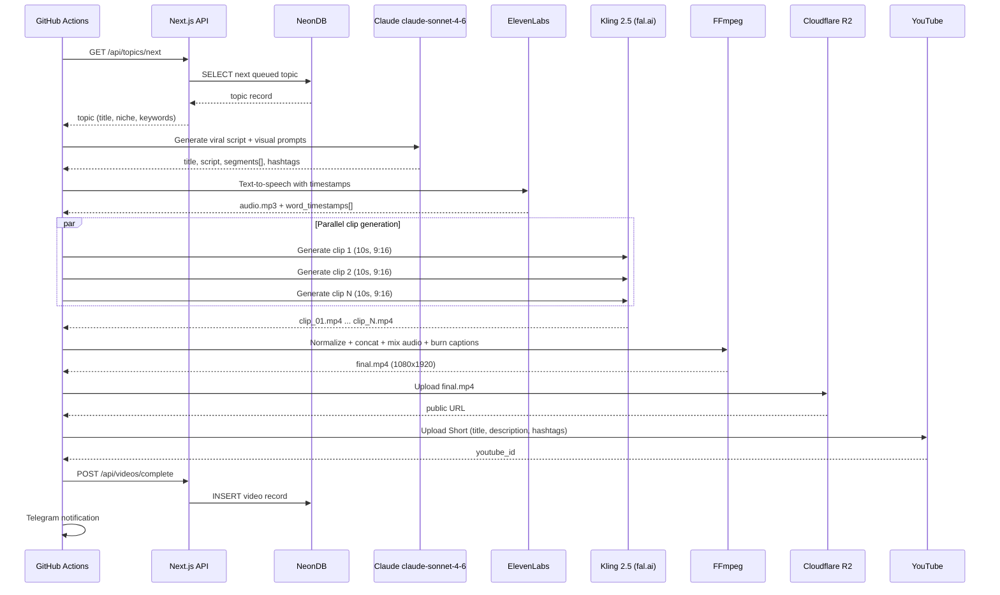
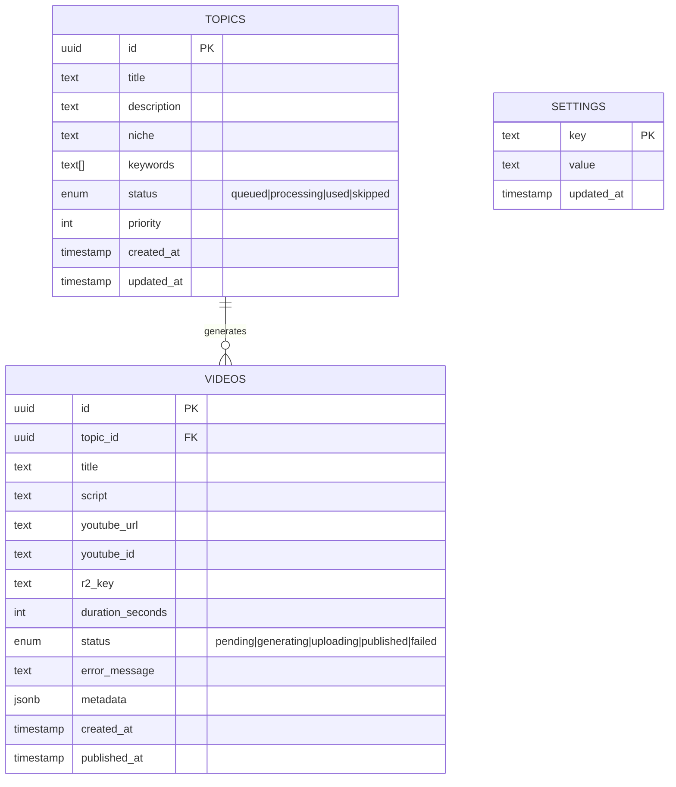

# Short Publisher

Autonomous YouTube Shorts generation and publishing platform. Produces cinematic 60–120 second Shorts daily using AI — from topic idea to published video with zero manual intervention.

**Stack:** Next.js 16 · NeonDB · Cloudflare R2 · GitHub Actions · Claude · ElevenLabs · Kling 2.5 · FFmpeg · YouTube Data API

---

## Architecture Overview



---

## Video Generation Pipeline



---

## Database Schema



---

## Cost Per Video

| Component | Tool | Cost |
|---|---|---|
| Script | Claude claude-sonnet-4-6 | ~$0.01 |
| Voiceover | ElevenLabs Multilingual v2 | ~$0.10 |
| Video clips (9 × 10s) | Kling 2.5 Pro via fal.ai | ~$2.61 |
| Assembly | FFmpeg (free) | $0.00 |
| Storage | Cloudflare R2 | ~$0.01 |
| **Total** | | **~$2.75** |

---

## Setup

### 1. Clone & install

```bash
git clone https://github.com/Ismat-Samadov/short_publisher
cd short_publisher
npm install
pip install -r scripts/requirements.txt
```

### 2. Configure environment

```bash
cp .env.example .env.local
# Fill in all values — see .env.example for documentation
```

### 3. Create database tables

```bash
npm run db:push
```

### 4. Get YouTube refresh token

```bash
python scripts/get_youtube_token.py
# Browser opens → authorize → token written to .env.local automatically
```

### 5. Deploy to Vercel

```bash
# Push to GitHub — Vercel auto-deploys on push
git push origin main
```

Add all `.env.local` variables to **Vercel → Settings → Environment Variables**.

### 6. Add GitHub Actions secrets

Go to **GitHub → Settings → Secrets and variables → Actions** and add:

| Secret | Description |
|---|---|
| `APP_URL` | Your Vercel deployment URL |
| `PIPELINE_SECRET_KEY` | Random secret for API auth |
| `ANTHROPIC_API_KEY` | Claude API key |
| `ELEVENLABS_API_KEY` | ElevenLabs API key |
| `ELEVENLABS_VOICE_ID` | ElevenLabs voice ID |
| `FAL_KEY` | fal.ai API key (Kling 2.5) |
| `R2_ACCOUNT_ID` | Cloudflare account ID |
| `R2_ACCESS_KEY_ID` | R2 access key |
| `R2_SECRET_ACCESS_KEY` | R2 secret key |
| `R2_BUCKET_NAME` | R2 bucket name |
| `R2_PUBLIC_URL` | R2 public URL |
| `YOUTUBE_CLIENT_ID` | Google OAuth client ID |
| `YOUTUBE_CLIENT_SECRET` | Google OAuth client secret |
| `YOUTUBE_REFRESH_TOKEN` | YouTube refresh token |
| `TELEGRAM_BOT_TOKEN` | Telegram bot token |
| `TELEGRAM_CHAT_ID` | Telegram chat ID |
| `GH_TOKEN` | GitHub PAT (repo + actions scope) |
| `GH_REPO` | `username/repo-name` |
| `GH_WORKFLOW_FILE` | `publish.yml` |
| `BACKGROUND_MUSIC_URL` | Direct MP3 URL (optional) |

### 7. Test with a dry run

**GitHub → Actions → Publish YouTube Short → Run workflow → ✓ Dry run → Run workflow**

This runs the full pipeline (script, audio, video, assembly) without uploading to YouTube.

---

## Dashboard Pages

| Page | Description |
|---|---|
| `/dashboard` | Stats, recent videos, queue preview |
| `/dashboard/topics` | Add/manage/prioritize video topics |
| `/dashboard/videos` | Full publish history |
| `/dashboard/pipeline` | Trigger runs, view GitHub Actions history |
| `/dashboard/settings` | Configure schedule, AI models, voice, YouTube |

---

## Project Structure

```
short_publisher/
├── .github/workflows/
│   └── publish.yml          # Daily cron + manual trigger
├── scripts/
│   ├── pipeline.py          # Main orchestrator
│   ├── generate_script.py   # Claude — viral hook-first scripts
│   ├── generate_audio.py    # ElevenLabs — voice + word timestamps
│   ├── generate_video_clips.py  # Kling 2.5 via fal.ai — cinematic clips
│   ├── assemble_video.py    # FFmpeg — normalize, concat, captions, music
│   ├── upload_youtube.py    # YouTube Data API v3
│   ├── upload_r2.py         # Cloudflare R2 upload
│   ├── get_youtube_token.py # One-time OAuth helper
│   └── requirements.txt
├── src/
│   ├── app/
│   │   ├── dashboard/       # Admin UI pages
│   │   ├── api/             # API routes for pipeline + dashboard
│   │   └── components/      # Shared UI components
│   └── lib/
│       ├── db/schema.ts     # Drizzle ORM — shortgen schema
│       ├── r2.ts            # Cloudflare R2 client
│       ├── telegram.ts      # Telegram notifications
│       └── auth.ts          # Pipeline key validation
├── .env.example             # All required env vars documented
└── drizzle.config.ts        # DB migration config
```

---

## License

MIT
